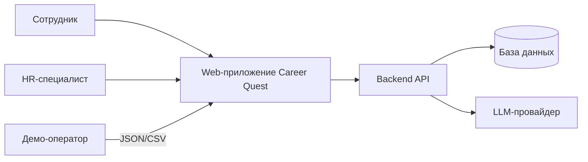
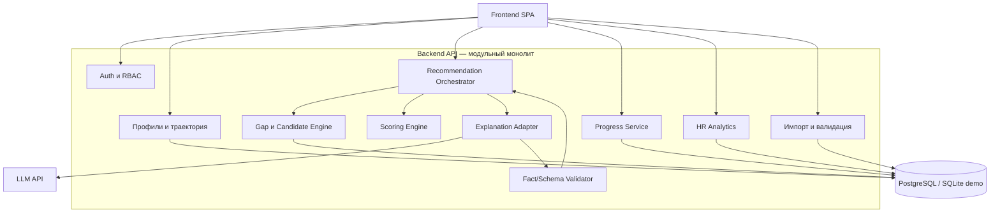
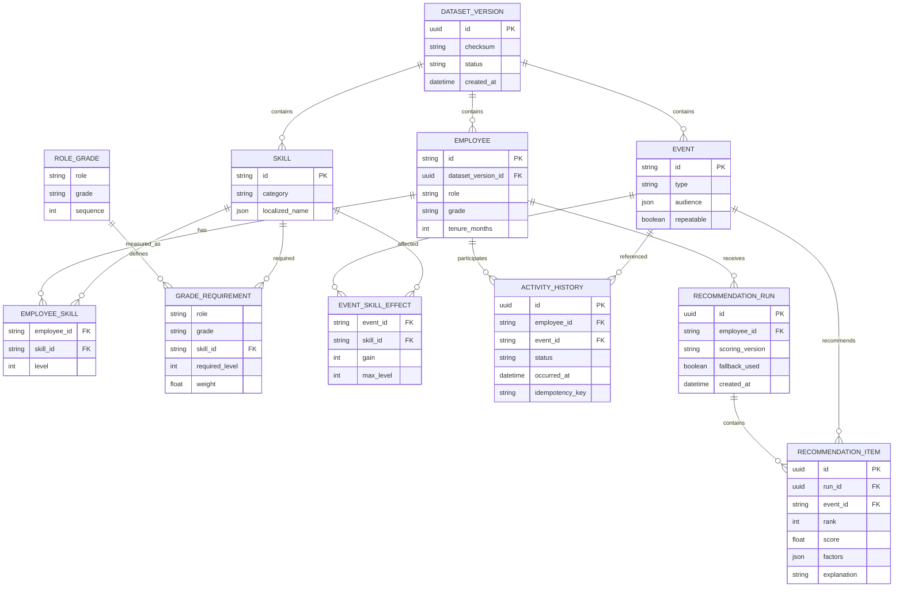
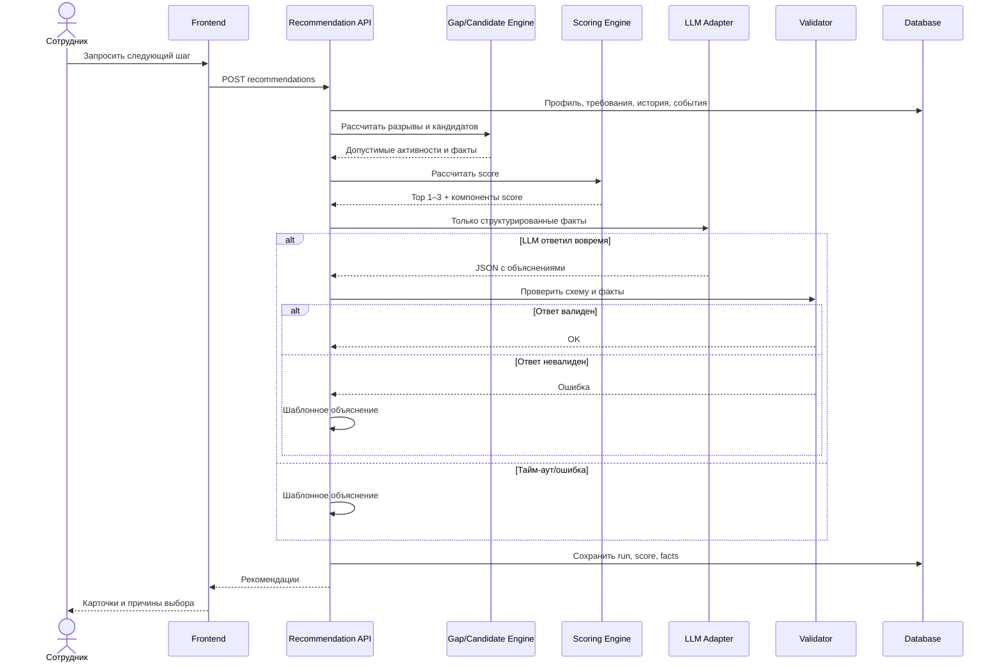
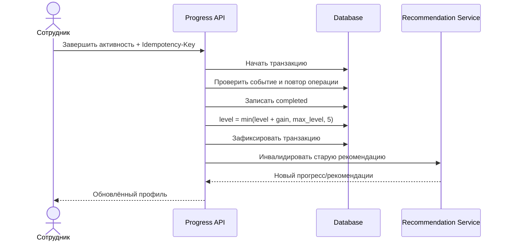
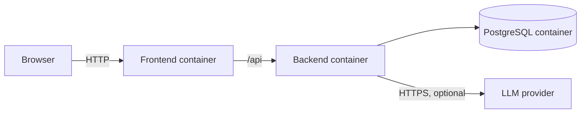

# Архитектура проекта Career Quest

## 1. Архитектурные цели

Архитектура должна обеспечить четыре свойства MVP:

1. **Объяснимость:** любое число и факт в рекомендации можно связать с исходными данными.
2. **Воспроизводимость:** приложение запускается одной командой и работает без внешней LLM в fallback-режиме.
3. **Расширяемость:** проверочный набор данных загружается без изменения кода.
4. **Надёжность:** AI улучшает формулировку и контекстный выбор, но его отказ не ломает основной сценарий.

Главный архитектурный принцип: **вычисления и факты отделены от генерации текста**. LLM не изменяет уровень навыка, не придумывает требования грейда и не пишет данные напрямую.

## 2. Контекст системы



Внешняя AI-модель — необязательная зависимость. При её отсутствии Backend API использует рассчитанный score и шаблонное объяснение.

## 3. Логическая архитектура

Для хакатона рекомендуется **модульный монолит**: один backend-процесс с чётко разделёнными модулями. Он быстрее в разработке и запуске, чем микросервисы, при этом границы позволяют позже выделить тяжёлые компоненты.



## 4. Ответственность компонентов

### 4.1. Frontend

Отвечает за:

- выбор демо-пользователя/роли;
- профиль, карту навыков и траекторию;
- карточки рекомендаций и раскрытие факторов;
- действие «завершить активность»;
- HR-дашборд;
- загрузку набора данных и отображение отчёта валидации;
- состояния загрузки, отсутствия данных и fallback.

Frontend не рассчитывает score и не применяет прирост навыков — это серверная логика.

### 4.2. Auth и RBAC

Отвечает за идентификацию пользователя и проверку ролей `employee`, `hr`, `admin`. Для демо можно использовать подписанный mock-token или заранее заданные аккаунты. Проверка выполняется на каждом защищённом endpoint.

### 4.3. Import Service

Выполняет:

1. загрузку файлов во временную область;
2. синтаксическую проверку JSON/CSV;
3. проверку схемы;
4. проверку связей между файлами;
5. нормализацию в доменную модель;
6. атомарное создание новой версии набора;
7. активацию версии только после успешной проверки.

### 4.4. Profile и Trajectory Service

Собирает профиль, требования следующего грейда, разрывы навыков и детерминированный процент прогресса. Возвращает также вклад каждого навыка, чтобы общий процент оставался объяснимым.

### 4.5. Gap и Candidate Engine

Чистый вычислительный модуль без LLM. Определяет:

- следующий грейд;
- релевантные навыки и их разрывы;
- допустимые активности;
- ожидаемое состояние навыков после каждой активности;
- причины исключения неподходящих активностей.

### 4.6. Scoring Engine

Присваивает кандидатам нормализованный score по конфигурируемой формуле. Сохраняет значения отдельных факторов, версию весов и итоговый порядок.

### 4.7. Recommendation Orchestrator

Координирует построение рекомендации:

1. запрашивает профиль и разрывы;
2. получает допустимых кандидатов;
3. ранжирует их;
4. выбирает верхние 1–3;
5. собирает ограниченный фактами контекст;
6. запрашивает объяснение у AI;
7. валидирует ответ;
8. при ошибке включает шаблонный fallback;
9. сохраняет результат для аудита и повторного показа.

### 4.8. Explanation Adapter

Изолирует конкретного LLM-провайдера. На вход принимает только структурированные факты, на выходе ожидает JSON по схеме. Поддерживает тайм-аут, ограниченное число повторов и fallback.

### 4.9. Fact/Schema Validator

Проверяет:

- соответствие ответа JSON Schema;
- наличие 1–3 рекомендаций;
- существование указанных `event_id` и `skill_id`;
- совпадение числовых значений с вычисленным контекстом;
- отсутствие новых, не переданных модели фактов;
- допустимую длину текста.

### 4.10. Progress Service

В транзакции записывает завершение активности, применяет `gain` с ограничением `max_level`, инвалидирует старую рекомендацию и инициирует пересчёт агрегатов. Идемпотентность обеспечивается уникальным ключом операции.

### 4.11. HR Analytics

Строит агрегаты средствами базы данных. На объёме MVP отдельное хранилище аналитики не требуется. При росте нагрузки этот модуль можно вынести в read model или аналитическую БД.

## 5. Рекомендуемый технологический стек

Стек можно адаптировать под компетенции команды; важнее сохранить границы модулей.

| Слой | Рекомендация | Причина |
|---|---|---|
| Frontend | React + TypeScript + Vite | Быстрый SPA, типизация контрактов, простой demo build. |
| UI | Tailwind CSS + готовый набор компонентов | Быстрое создание аккуратного интерфейса. |
| Backend | Python 3.12 + FastAPI + Pydantic | Удобная валидация JSON/CSV и AI-ответов, автоматический OpenAPI. |
| ORM/миграции | SQLAlchemy + Alembic | Явная модель данных и управляемая схема. |
| Основная БД | PostgreSQL | Транзакции, JSONB, аналитические запросы. |
| Упрощённый demo mode | SQLite | Запуск без отдельной инфраструктуры. |
| AI | Provider adapter с JSON Schema output | Возможность менять облачную или локальную модель. |
| Тесты | Pytest, Vitest, Playwright | Unit, contract и сквозные проверки. |
| Запуск | Docker Compose + Make/PowerShell wrapper | Одна команда для воспроизводимого старта. |

Если времени мало, следует выбрать одну БД. PostgreSQL предпочтителен для защиты; SQLite полезен только как дополнительный локальный режим.

## 6. Доменная модель



## 7. API-контракты MVP

| Метод и путь | Роль | Назначение |
|---|---|---|
| `POST /api/v1/datasets/import` | admin | Загрузить и проверить набор данных. |
| `GET /api/v1/datasets/{id}/status` | admin | Получить отчёт импорта. |
| `GET /api/v1/me/profile` | employee | Получить собственный профиль и траекторию. |
| `GET /api/v1/employees/{id}` | hr | Получить разрешённое представление профиля. |
| `POST /api/v1/employees/{id}/recommendations` | employee/hr | Рассчитать рекомендации. |
| `GET /api/v1/employees/{id}/recommendations/latest` | employee/hr | Получить последний результат. |
| `POST /api/v1/activities/{eventId}/complete` | employee | Завершить активность идемпотентно. |
| `GET /api/v1/hr/skill-gaps` | hr | Агрегат дефицитов навыков. |
| `GET /api/v1/hr/participation` | hr | Участие по активностям. |
| `GET /api/v1/hr/uncovered-employees` | hr | Сотрудники без следующего шага. |
| `GET /health/live` | system | Проверка процесса. |
| `GET /health/ready` | system | Проверка БД и обязательных зависимостей. |

Индивидуальные endpoints должны проверять, что `employee` запрашивает собственный `id`. Для операций записи клиент передаёт `Idempotency-Key`.

## 8. Поток построения рекомендации



## 9. Поток завершения активности



## 10. Стратегия AI и защита от ошибок

### Контекст для модели

В prompt передаются только:

- обезличенный ID;
- роль, текущий и целевой грейд;
- рассчитанные разрывы;
- top-кандидаты и их score-факторы;
- агрегированная релевантная история;
- требуемая JSON-схема и язык ответа.

### Что запрещено делегировать LLM

- изменение данных;
- вычисление финального уровня навыка;
- определение прав доступа;
- создание несуществующих событий;
- выдача рекомендации вне списка допустимых кандидатов;
- самостоятельное использование полной истории без минимизации данных.

### Fallback

Шаблон строится из тех же фактов:

```text
Рекомендуем «{event_name}»: навык {skill_name} сейчас {current},
для {target_grade} требуется {required}. Активность может повысить уровень
на {effective_gain}. В истории: {history_summary}.
```

## 11. Безопасность и приватность

- RBAC применяется в API, а не только в UI.
- Демо-идентификаторы не содержат ФИО и контактов.
- Секреты AI и БД передаются через environment/secrets store.
- Prompt и AI-ответы логируются без идентифицирующих данных либо только по debug-флагу.
- Файлы импорта ограничиваются по типу и размеру, имя файла не используется как путь хранения.
- Все SQL-запросы параметризованы через ORM/query builder.
- CORS ограничивается адресом frontend.
- Для production предусматриваются SSO/OIDC, аудит доступа и сроки хранения данных.

## 12. Производительность и кэширование

Для объёма хакатона достаточно синхронного API и индексов:

- `employee_skill(employee_id, skill_id)`;
- `activity_history(employee_id, occurred_at)`;
- `activity_history(event_id, status)`;
- `grade_requirement(role, grade, skill_id)`;
- `recommendation_run(employee_id, created_at)`.

Можно кэшировать последнюю рекомендацию по ключу:

```text
employee_id + profile_version + history_version + scoring_version + dataset_version
```

Любое завершение активности или активация нового набора меняет версию и автоматически делает кэш устаревшим.

## 13. Развёртывание



Минимальный `docker compose up --build` поднимает frontend, backend и БД. Миграции и загрузка demo data выполняются автоматически или отдельной идемпотентной командой, вызываемой из стартового скрипта.

## 14. Тестовая стратегия

### Unit-тесты

- расчёт разрывов;
- формула прогресса;
- фильтрация кандидатов;
- каждый компонент score;
- `gain`/`max_level`;
- идемпотентность завершения;
- fallback-шаблоны.

### Контрактные тесты

- схемы входных файлов;
- OpenAPI-ответы;
- JSON Schema AI-ответа;
- адаптер LLM с записанными mock-ответами.

### Интеграционные тесты

- импорт полного набора;
- построение рекомендаций с БД;
- транзакционное обновление прогресса;
- пересчёт HR-агрегатов;
- отказ/тайм-аут LLM.

### E2E-тесты

- профиль → рекомендация → завершение → новый прогресс;
- загрузка проверочного профиля;
- HR-фильтры;
- запрет доступа к чужому профилю.

## 15. Решения и компромиссы

| Решение | Почему принято | Компромисс |
|---|---|---|
| Модульный монолит | Минимум инфраструктуры, быстрый MVP. | Масштабирование модулей пока совместное. |
| Гибрид rules + score + LLM | Объяснимость и устойчивость при хорошем AI-демо. | Нужно поддерживать и формулу, и prompt. |
| PostgreSQL | Транзакции и удобная аналитика. | Требуется контейнер БД. |
| Синхронная рекомендация | Соответствует лимиту 10 секунд и упрощает UI. | Для медленных моделей позже понадобится job queue. |
| Сохранение score/facts | Аудит и воспроизводимость. | Дополнительный объём данных. |

## 16. Возможное развитие после MVP

- SSO/OIDC и интеграция с HRIS/LMS;
- feedback loop по принятым и отклонённым рекомендациям;
- offline-оценка качества и A/B-тесты весов;
- обучаемый learning-to-rank поверх прозрачных признаков;
- каталог наград и добровольные командные механики;
- локализация на казахский и русский;
- event-driven интеграции и очередь задач;
- отдельная аналитическая read model;
- мониторинг fairness между ролями, грейдами и подразделениями.
