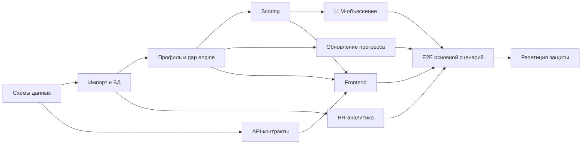

# План проекта Career Quest

## 1. Цель плана
~
План ориентирован на создание демонстрируемого MVP в условиях хакатона. Приоритет — не количество экранов, а доказательство сквозного сценария и качества многофакторной, объяснимой рекомендации.

## 2. Принципы выполнения

1. Сначала работающий вертикальный сценарий, затем визуальные улучшения.
2. Детерминированные расчёты реализуются раньше интеграции с LLM.
3. Все данные проходят через единую доменную модель и валидацию.
4. Каждый этап заканчивается проверяемым результатом.
5. Must-have имеет приоритет над геймификацией и дополнительной аналитикой.
6. Demo mode и fallback готовятся заранее, а не перед защитой.

## 3. Приоритеты

### P0 — обязательно для защиты

- импорт исходного и проверочного набора;
- профиль сотрудника и карьерная траектория;
- расчёт разрывов по требованиям следующего грейда;
- 1–3 многофакторные рекомендации;
- объяснение на основе минимум трёх факторов;
- завершение активности и обновление прогресса;
- HR-view;
- роли сотрудника и HR;
- fallback без LLM;
- README и запуск одной командой.

### P1 — желательно

- локализация интерфейса RU/KZ;
- визуализация вкладов в score;
- сравнение прогресса «до/после»;
- фильтры и drill-down в HR-view;
- экспорт диагностического отчёта импорта;
- demo script и автоматизированный smoke test.

### P2 — только при запасе времени

- внутренняя валюта;
- награды и добровольные челленджи;
- менторские механики;
- расширенная аналитика;
- интеграции с календарями/мессенджерами;
- прогноз риска оттока.

## 4. Этапы проекта

### Этап 0. Уточнение данных и фиксация контрактов

**Цель:** убрать неопределённость до начала параллельной разработки.

Задачи:

- изучить реальные файлы стартового набора;
- зафиксировать JSON Schema/CSV-схемы;
- уточнить порядок грейдов и статусы истории;
- определить правила повторного прохождения;
- подготовить 3–5 контрольных профилей, включая сложный пример из ТЗ;
- согласовать API-контракты frontend/backend;
- зафиксировать формулу прогресса и первую версию score.

Результат:

- схемы данных;
- примеры валидного и невалидного импорта;
- OpenAPI-черновик;
- набор ожидаемых рекомендаций для контрольных профилей.

Критерий выхода: команда может вручную объяснить, почему для каждого контрольного профиля выбран конкретный шаг.

### Этап 1. Каркас и воспроизводимый запуск

**Цель:** получить минимальную систему, которую одинаково запускают все участники.

Задачи:

- создать frontend и backend;
- настроить БД и миграции;
- добавить конфигурацию через `.env.example`;
- создать Docker Compose;
- добавить health endpoints;
- настроить lint/test команды и базовый CI;
- реализовать demo data seed.

Результат: одной командой открывается frontend, backend отвечает, БД готова.

Критерий выхода: чистое окружение поднимает проект по README без ручного исправления кода.

### Этап 2. Импорт и доменная модель

**Цель:** поддержать реальные и проверочные данные.

Задачи:

- реализовать парсеры JSON/CSV;
- проверить схемы и межфайловые ссылки;
- нормализовать данные в БД;
- реализовать версионирование и атомарную активацию набора;
- сделать отчёт ошибок импорта;
- добавить unit и integration тесты.

Результат: набор загружается через API/экран, ошибки понятны пользователю.

Критерий выхода: повторная загрузка изменённого валидного набора не требует изменения кода, а невалидный набор не портит активные данные.

### Этап 3. Профиль и траектория

**Цель:** показать сотруднику исходное состояние и путь к следующему грейду.

Задачи:

- определить следующий грейд;
- рассчитать требования и разрывы;
- реализовать объяснимую формулу прогресса;
- создать API профиля;
- собрать экран профиля, навыков и истории;
- обработать отсутствие следующего грейда/данных.

Результат: профиль полностью строится из импортированного набора.

Критерий выхода: для контрольного сотрудника значения интерфейса совпадают с ручным расчётом.

### Этап 4. Детерминированное ядро рекомендаций

**Цель:** получить качественную рекомендацию до подключения LLM.

Задачи:

- реализовать фильтрацию допустимых активностей;
- вычислить ожидаемый эффект каждой активности;
- реализовать многофакторный score;
- сохранить компоненты score и версию формулы;
- сформировать top-1–3;
- создать шаблонное объяснение;
- написать тесты на однофакторную ловушку из ТЗ.

Результат: recommendations endpoint работает без внешнего AI.

Критерий выхода: контрольные профили дают ожидаемый порядок, а объяснение содержит минимум три факта.

### Этап 5. AI-объяснение и guardrails

**Цель:** сделать объяснение естественным, сохранив фактическую точность.

Задачи:

- определить JSON Schema ответа LLM;
- реализовать provider adapter;
- минимизировать и обезличить prompt-контекст;
- добавить тайм-аут и ограниченный retry;
- проверять ID, числа и факты ответа;
- автоматически включать fallback;
- замерять latency и долю fallback.

Результат: рекомендации имеют естественное объяснение; отказ AI незаметно деградирует до шаблона.

Критерий выхода: набор ошибочных mock-ответов LLM не приводит к ложным фактам или сбою интерфейса.

### Этап 6. Завершение активности и пересчёт

**Цель:** замкнуть основной продуктовый цикл.

Задачи:

- реализовать команду завершения;
- добавить идемпотентность;
- применить `gain` и `max_level` в транзакции;
- пересчитать прогресс и рекомендации;
- показать в UI изменение «до/после»;
- покрыть повторы и граничные уровни тестами.

Результат: выполненная активность меняет навыки и траекторию.

Критерий выхода: повторный запрос не даёт двойной прирост, все экраны показывают согласованные данные.

### Этап 7. HR-view и доступ

**Цель:** закрыть второй пользовательский сценарий.

Задачи:

- реализовать агрегаты дефицитов;
- показать участие по активностям;
- вывести сотрудников без следующего шага;
- добавить фильтры по роли и грейду;
- реализовать роли и серверные policy checks;
- проверить отсутствие доступа к чужому профилю.

Результат: HR получает полезный срез, сотрудник не видит чужие данные.

Критерий выхода: авторизационные тесты и сверка агрегатов с SQL/ручным расчётом проходят.

### Этап 8. Стабилизация и подготовка защиты

**Цель:** сделать демонстрацию воспроизводимой и устойчивой.

Задачи:

- пройти сквозные acceptance-сценарии;
- проверить запуск на чистой машине;
- измерить задержки;
- подготовить режим с отключённой LLM;
- заполнить README: архитектура, запуск, конфигурация, данные, demo flow;
- подготовить backup-видео/скриншоты;
- устранить критические и высокие дефекты;
- заморозить P2-функции.

Результат: готовый релиз-кандидат и сценарий демонстрации.

Критерий выхода: два последовательных прогона demo script проходят без ручного вмешательства.

## 5. Рекомендуемое распределение работ

Для команды из 4 человек:

| Роль | Основная зона | Дополнительная зона |
|---|---|---|
| Backend/Data | импорт, БД, профиль, прогресс | Docker/миграции |
| AI/Recommendation | gap engine, scoring, LLM, eval | аналитические запросы |
| Frontend/Product | профиль, рекомендации, HR-view | локализация/UX |
| QA/Integration/DevOps | контракты, E2E, CI, README | demo script и презентация |

В маленькой команде зоны объединяются, но ответственность за проверку рекомендации и воспроизводимость должна оставаться явной.

## 6. Вариант графика на 48 часов

| Время | Контрольная точка | Обязательный результат |
|---|---|---|
| 0–4 ч | Данные и дизайн решения | Схемы, wireframe, score v1, API-контракты. |
| 4–10 ч | Каркас | Проект поднимается одной командой, БД и health работают. |
| 10–18 ч | Вертикальный срез v1 | Импорт → профиль → детерминированная рекомендация. |
| 18–26 ч | Основной цикл | Завершение активности → новый прогресс/рекомендация. |
| 26–32 ч | AI и HR | Валидируемое объяснение, fallback, базовый HR-view. |
| 32–38 ч | Интеграция | Роли, проверочный импорт, E2E happy path. |
| 38–43 ч | Стабилизация | Исправление дефектов, latency, чистый запуск. |
| 43–48 ч | Защита | README, demo script, презентация, резервный прогон. |

Если формат хакатона короче, сокращаются P1/P2 и визуальная полировка, но не fallback, импорт проверочных профилей и сквозной цикл.

## 7. Зависимости между работами

Критический путь: схема данных → импорт → профиль/gap → scoring → frontend-интеграция → E2E → защита.

## 8. План тестирования

### На каждый pull request/изменение

- lint и type checking;
- unit-тесты затронутых модулей;
- проверка миграций;
- отсутствие секретов в diff.

### Перед объединением вертикального среза

- импорт demo data;
- профиль контрольного сотрудника;
- детерминированный top-3;
- проверка объясняющих факторов;
- замер времени ответа.

### Перед релиз-кандидатом

- все сценарии из `REQUIREMENTS.md`;
- LLM success, timeout, malformed JSON и hallucinated ID;
- повторное завершение активности;
- невалидный импорт;
- доступ employee к чужим данным;
- чистый `docker compose up --build`;
- работа без AI-ключа.

## 9. Оценка качества рекомендаций

Технической работоспособности недостаточно — ядро проекта оценивается отдельно.

Минимальный eval-набор:

- 3 профиля жюри/аналогичных сложных профиля;
- профиль без разрывов;
- профиль без подходящих событий;
- профиль с повторными пропусками;
- профиль, где одна активность закрывает несколько разрывов;
- профиль на максимальном грейде.

Метрики MVP:

- `Top-3 relevance`: ожидаемая экспертами активность присутствует в top-3;
- `Top-1 agreement`: совпадение первого шага с экспертной разметкой;
- `Fact accuracy`: доля числовых/сущностных фактов без ошибок, цель 100%;
- `Explanation coverage`: минимум три релевантных фактора;
- `Fallback rate` и p95 latency;
- доля сотрудников без доступного шага.

Разметку контрольного набора следует хранить отдельно от production/demo данных, чтобы не подгонять ответы вручную.

## 10. Риски и меры снижения

| Риск | Вероятность/влияние | Мера |
|---|---|---|
| Реальная схема данных отличается от ожиданий | Высокая/высокое | Сначала адаптеры и JSON Schema, доменная модель не зависит от имён внешних полей. |
| LLM отвечает медленно | Средняя/высокое | Тайм-аут, top-кандидаты считаются локально, шаблонный fallback. |
| LLM придумывает факты | Средняя/высокое | Structured output, allowlist ID, сверка чисел, отказ от невалидного текста. |
| Команда тратит время на геймификацию | Высокая/высокое | P0 freeze до прохождения сквозных тестов. |
| Frontend и backend расходятся по контрактам | Средняя/среднее | OpenAPI и сгенерированные/общие типы, mock API в начале. |
| Двойное начисление навыка | Средняя/высокое | Идемпотентный ключ и уникальное ограничение БД. |
| Проверочный профиль не импортируется | Средняя/высокое | E2E-тест загрузки нового набора без перезапуска/изменения кода. |
| Утечка индивидуальной истории | Низкая/высокое | Серверный RBAC, privacy-тесты, обезличенные логи. |
| Demo зависит от интернета | Средняя/высокое | Полноценный offline/demo mode и заранее прогретые шаблонные ответы. |
| Запуск работает только у автора | Средняя/высокое | Проверка на чистом окружении и одна команда запуска. |

## 11. Контрольные точки Go/No-Go

### Go/No-Go 1: после импорта

Продолжать AI-интеграцию только если реальный набор стабильно загружается и профиль собирается без ручных исключений.

### Go/No-Go 2: после scoring

Продолжать визуальные и P1-функции только если сложный контрольный профиль проходит многофакторный тест.

### Go/No-Go 3: перед feature freeze

Остановить новые функции, если не проходят импорт проверочного набора, завершение активности, RBAC или fallback.

### Go/No-Go 4: перед защитой

Релиз допускается к демонстрации после двух чистых прогонов и проверки запуска без AI-ключа.

## 12. Demo script

Рекомендуемая демонстрация занимает 4–6 минут:

1. Открыть профиль Middle Backend Engineer.
2. Показать требования Senior и разрывы навыков.
3. Запросить рекомендации.
4. Раскрыть первую карточку и показать минимум три фактора.
5. Сравнить с наивным выбором самого низкого навыка и объяснить, почему система выбрала иначе.
6. Завершить рекомендованную активность.
7. Показать прирост навыка, прогресса и новую рекомендацию.
8. Перейти в HR-view и показать обновлённые агрегаты.
9. Загрузить/выбрать проверочный профиль и подтвердить работу без изменения кода.
10. Кратко показать fallback и архитектуру.

## 13. Артефакты проекта

К концу работ в репозитории должны быть:

- исходный код frontend/backend;
- миграции и demo data;
- схемы входных данных;
- `.env.example` без секретов;
- Docker Compose и единая команда запуска;
- unit/integration/E2E тесты;
- `README.md` с быстрым стартом;
- `REQUIREMENTS.md`;
- `ARCHITECTURE.md`;
- `PROJECT_PLAN.md`;
- demo script;
- краткое описание AI-подхода и eval-результатов.

## 14. Definition of Done релиза

- P0-функции реализованы и связаны в один сценарий;
- контрольные acceptance-тесты проходят;
- рекомендация основана минимум на трёх факторах;
- все факты AI-объяснения проверяются;
- завершение активности идемпотентно;
- HR-агрегаты согласованы с данными;
- роли проверяются на сервере;
- p95 интерфейсных API укладывается в 2 секунды, AI-путь — в 10 секунд;
- приложение работает при недоступной LLM;
- новый набор данных импортируется без изменения кода;
- запуск и демонстрация воспроизводятся по документации.
